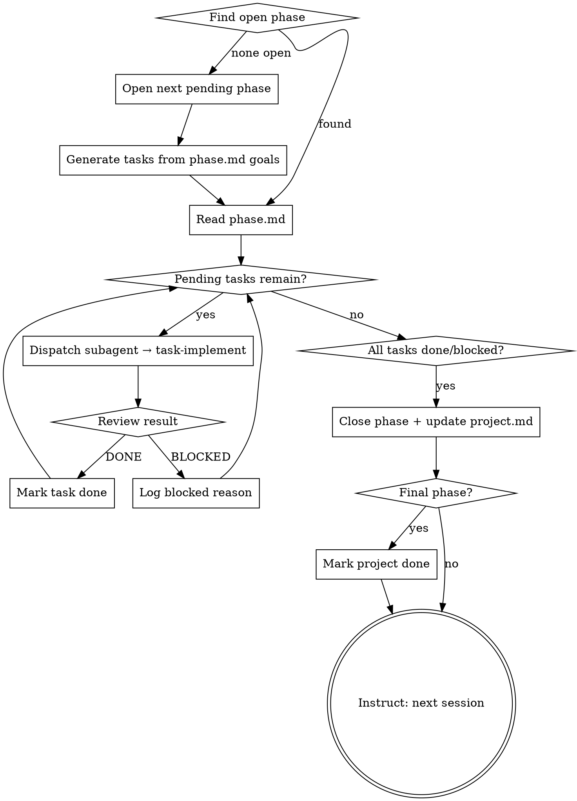

# Phase Execute

Supervises execution of a single project phase. Finds the current open phase, dispatches a subagent per task (each invoking `task-implement`), monitors results, and closes the phase when done. The executor never implements — it only supervises.

## When to Use

- Starting a new session to work on a project with a `.tasks/` folder
- A phase was just opened by `project-orchestrate` or a prior phase just closed
- Resuming a phase that was partially completed

## Process



### Step 1 — Find the Current Phase

Scan `.tasks/` for a `phase.md` with `status: open`. If none found, find the next `status: pending` phase (lowest phase number).

If the pending phase has no task files yet, generate them from its `phase.md` goals — same format as `project-orchestrate` uses. Commit: `chore(phase-N): open — generating M tasks`.

### Step 2 — Read Phase Context

Read `phase.md` to load:
- Phase goal
- Exit criteria
- Task list (checked items = done, unchecked = pending/in-progress)

Read `.tasks/project.md` for overall project context.

### Step 3 — Dispatch Tasks

For each task file with `status: pending`, dispatch a subagent:

**Model selection by complexity:**
| complexity | model |
|-----------|-------|
| low | claude-haiku-4-5-20251001 |
| medium | claude-sonnet-4-6 |
| high | claude-opus-4-6 |

**Subagent prompt template:**
```
You are implementing a task in an agentic project workflow.

Project: <project title>
Phase <N>: <phase title>
Goal: <phase goal>

Task file: <absolute path to task-NN-name.md>

Invoke the `task-implement` skill to execute this task. Read the task file first to understand what's needed.

When complete, return one of:
- DONE — task complete, acceptance criteria met
- DONE_WITH_CONCERNS — done but with issues noted in task Notes
- BLOCKED — could not complete, reason documented in task Notes
```

**Run tasks sequentially by default.** Only parallelize if tasks have no dependencies on each other (check `blocked-by` fields).

### Step 4 — Review Results

After each subagent returns:
1. Read the updated task file
2. Verify `status` was updated
3. Verify acceptance criteria are checked off (for DONE)
4. If DONE_WITH_CONCERNS: read Notes, decide whether to continue or address concerns
5. If BLOCKED: ensure reason is documented in Notes, continue to next task

Commit after each task: `chore(task-NN): done — <title>` or `chore(task-NN): blocked — <title>`

### Step 5 — Close Phase

When all tasks are `done` or `blocked`:
1. Update `phase.md`: `status: closed`, `closed: <date>`
2. Update `project.md` task checklist for this phase: `- [x] Phase N: <title>`
3. Increment `current-phase` in `project.md`
4. Commit: `chore(phase-N): closed`
5. Push

If this was the final phase: set `project.md` `status: done`, commit, push.

### Step 6 — Hand Off

Output to the human:

> Phase N complete. X tasks done, Y blocked.
> [If blocked tasks]: Review `.tasks/phase-N/` for blocked task details.
> Start a new session and invoke `phase-execute` for Phase N+1.

Or if project is done:
> Project complete. All phases closed. See `.tasks/project.md` for summary.

## Key Rules

- **Executor never implements** — all implementation work goes to subagents
- **Phases are the archive boundary** — never read or modify closed phases
- **Source of truth is `.tasks/`** — always read current file state, don't rely on memory
- **Commit every state change** — phase open, task done/blocked, phase close
- **Sequential by default** — only parallelize tasks with no `blocked-by` dependencies
