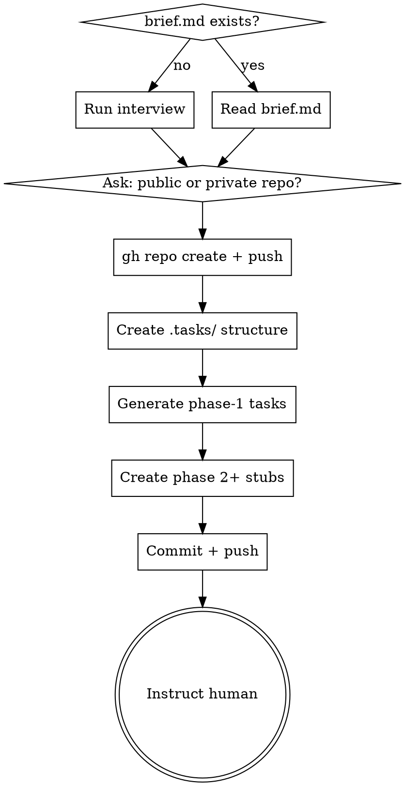

# Project Orchestrate

Sets up a persistent, git-tracked project workspace under `.tasks/` — a high-level plan split into phases, each phase into trackable task files. Designed for hand-off across multiple agent sessions. Also extends an existing `.tasks/` project by appending new phases (post-completion or mid-stream).

## When to Use

- Starting a new software project that will span multiple sessions
- User has a `brief.md` describing the project
- User wants multi-phase work with isolated phase execution
- A `.tasks/` project already exists and the user wants to append more phases (with or without an `extension.md` brief)

## Process

**Routing:** First action — check for `.tasks/project.md`. If absent, run the **Bootstrap** flow (Steps 1–6). If present, run the **Extension** flow (Steps E1–E5 in "Extending a Project" below).



### Step 1 — Gather Project Info

Check for `brief.md` in the project root. If found, read it. If not, interview the user:
- What is the project goal?
- What are the major phases? (e.g., Foundation → API → Frontend → Deploy)
- Any constraints (tech stack, deadlines, dependencies)?

Check `brief.md` for a `repo:` field (`public` or `private`). If missing, ask the user.

**brief.md supported fields:**
```yaml
title: My App
goal: |
  What the project builds and why.
repo: private           # public | private
phases:
  - name: Foundation
    goal: Set up database, auth, and core models
  - name: API Layer
    goal: REST endpoints for all resources
```

### Step 2 — Create GitHub Repo

```bash
gh repo create <project-name> --<private|public> --source=. --remote=origin --push
```

If the repo already exists remotely, just set the remote and push.

### Step 3 — Create `.tasks/` Structure

**`project.md`:**
```yaml
---
title: <project title>
status: in-progress
current-phase: 1
repo: <private|public>
github: <repo URL>
created: <YYYY-MM-DD>
---
## Goal
<project goal>

## Phases
- [ ] Phase 1: Foundation
- [ ] Phase 2: API Layer
```

**`phase-N/phase.md`** (one per phase):
```yaml
---
phase: <N>
title: <phase title>
status: open        # first phase only; rest are: pending
opened: <YYYY-MM-DD>  # first phase only
closed: ~
---
## Goal
<what this phase accomplishes>

## Exit Criteria
<what must be true before this phase closes>

## Tasks
- [ ] task-01-<name>.md
- [ ] task-02-<name>.md
```

### Step 4 — Generate Phase 1 Task Files

For phase 1 only, create individual task files. Subsequent phases get a `phase.md` stub only — tasks are generated when the phase opens (to stay relevant).

**`phase-1/task-NN-name.md`:**
```yaml
---
id: task-<NN>
title: <task title>
status: pending
complexity: <low|medium|high>
blocked-by: ~
---
## Goal
<what this task must accomplish>

## Context
<relevant background, links to related files or prior work>

## Acceptance Criteria
- [ ] <criterion 1>
- [ ] <criterion 2>

## Notes
```

**Complexity guidance:**
- `low` — straightforward, well-defined, < 30 min estimated
- `medium` — requires judgment or multiple files
- `high` — complex logic, cross-cutting concerns, or unknowns

### Step 5 — Commit & Push

Commit message: `chore(tasks): init project — N phases, M tasks`

Push to the GitHub repo created in Step 2.

### Step 6 — Hand Off

Output to the human:

> Phase 1 is ready with M tasks. Start a new session in this directory and invoke `phase-execute` to begin execution.

## Extending a Project

Use this flow when `.tasks/project.md` already exists and the user wants to append new phases — either after the project was marked `done` or mid-stream while a phase is still open. Closed phases are never modified.

**`extension.md` supported fields** (same shape as `brief.md`'s `phases:` block; `title`/`repo` already live in `project.md`):

```yaml
---
phases:
  - name: UI Polish
    goal: Address feedback from user testing on dashboard
    exit-criteria: |
      - All flagged dashboard issues resolved
      - Visual QA passed on Chrome/Firefox/Safari
  - name: Performance pass
    goal: Reduce dashboard p95 load to <500ms
---
## Notes
Free-form context the assistant should read before generating tasks.
```

### Step E1 — Detect Extension Mode

Read `.tasks/project.md`. Capture from frontmatter: `title`, `status`, `current-phase`. From `## Phases`, capture each entry and whether the checkbox is `[x]` or `[ ]`.

### Step E2 — Load Existing Phase State

Glob `.tasks/phase-*/phase.md`. Parse each frontmatter (`phase`, `title`, `status`, `opened`, `closed`). Compute the highest existing phase number `K` from the `phase:` field — do **not** rely on folder lexical sort (`phase-10` would sort before `phase-2`). Note whether any phase has `status: open`.

### Step E3 — Gather New Phases

Look for `extension.md` in the repo root. If present, read its `phases:` list and any `## Notes` section.

If absent, interview the user:
- "What new work needs to happen?"
- "How would you split it into phases (if more than one)?"
- "Any exit criteria for each?"

### Step E4 — Append Phases

For each new phase, numbering from `K+1`:

- Append `- [ ] Phase N: <title>` to `## Phases` in `.tasks/project.md`.
- Create `.tasks/phase-N/phase.md` with `status: pending`, `opened: ~`, `closed: ~`, the goal, exit criteria, and an **empty Tasks list**. Do not pre-generate task files — `phase-execute` generates them when it opens the phase.
- Update `.tasks/project.md` frontmatter:
  - If `status: done`, flip to `status: in-progress`.
  - Set `current-phase` to the lowest phase number with `status: open` or `status: pending`. If a phase is already open, leave `current-phase` on it; otherwise it becomes `K+1`.
- Do not modify any closed phase's files or `closed:` date. Do not modify task files inside closed phases.

### Step E5 — Commit, Push, Hand Off

- If `extension.md` was used, delete it (so a later run doesn't reapply it and `project-status` doesn't keep flagging it).
- Commit: `chore(tasks): extend with N phase(s) — <comma-separated titles>`.
- Push.
- Output to the human:

> Added Phase K+1..K+N. Start a new session and invoke `phase-execute` to begin.

## Edge Cases

- **Mid-stream extension while a phase is open** — append after the open phase. Don't touch the open phase or its tasks. `current-phase` stays on the open phase.
- **`extension.md` exists but `.tasks/` doesn't** — error with: *"Found extension.md but no .tasks/ project. Did you mean brief.md?"* Do not auto-rename or proceed.
- **Project status was `done`** — flip to `in-progress`. Leave closed phases' `closed:` dates intact and untouched.
- **User wants tasks pre-filled in the new phase** — out of scope. Tasks are deferred to `phase-execute`. If the user wants explicit task control, they can edit `phase-N/phase.md` after the skill runs.

## Key Rules

- **Never generate task files for future phases** at project start — they will be created when the phase opens, based on what was learned in prior phases.
- **Phases are the archive boundary** — closed phases are never touched again by executors.
- **`.tasks/` is the single source of truth** — any agent in any session can reconstruct full project state by reading it.
