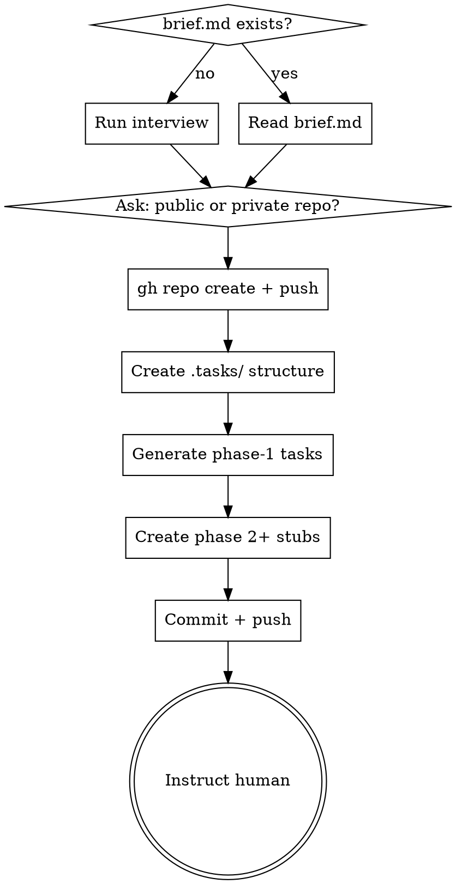

# Project Orchestrate

Sets up a persistent, git-tracked project workspace under `.tasks/` — a high-level plan split into phases, each phase into trackable task files. Designed for hand-off across multiple agent sessions.

## When to Use

- Starting a new software project that will span multiple sessions
- User has a `brief.md` describing the project
- User wants multi-phase work with isolated phase execution

## Process



### Step 1 — Gather Project Info

Check for `brief.md` in the project root. If found, read it. If not, interview the user:
- What is the project goal?
- What are the major phases? (e.g., Foundation → API → Frontend → Deploy)
- Any constraints (tech stack, deadlines, dependencies)?

Check `brief.md` for a `repo:` field (`public` or `private`). If missing, ask the user.

**brief.md supported fields:**
```yaml
title: My App
goal: |
  What the project builds and why.
repo: private           # public | private
phases:
  - name: Foundation
    goal: Set up database, auth, and core models
  - name: API Layer
    goal: REST endpoints for all resources
```

### Step 2 — Create GitHub Repo

```bash
gh repo create <project-name> --<private|public> --source=. --remote=origin --push
```

If the repo already exists remotely, just set the remote and push.

### Step 3 — Create `.tasks/` Structure

**`project.md`:**
```yaml
---
title: <project title>
status: in-progress
current-phase: 1
repo: <private|public>
github: <repo URL>
created: <YYYY-MM-DD>
---
## Goal
<project goal>

## Phases
- [ ] Phase 1: Foundation
- [ ] Phase 2: API Layer
```

**`phase-N/phase.md`** (one per phase):
```yaml
---
phase: <N>
title: <phase title>
status: open        # first phase only; rest are: pending
opened: <YYYY-MM-DD>  # first phase only
closed: ~
---
## Goal
<what this phase accomplishes>

## Exit Criteria
<what must be true before this phase closes>

## Tasks
- [ ] task-01-<name>.md
- [ ] task-02-<name>.md
```

### Step 4 — Generate Phase 1 Task Files

For phase 1 only, create individual task files. Subsequent phases get a `phase.md` stub only — tasks are generated when the phase opens (to stay relevant).

**`phase-1/task-NN-name.md`:**
```yaml
---
id: task-<NN>
title: <task title>
status: pending
complexity: <low|medium|high>
blocked-by: ~
---
## Goal
<what this task must accomplish>

## Context
<relevant background, links to related files or prior work>

## Acceptance Criteria
- [ ] <criterion 1>
- [ ] <criterion 2>

## Notes
```

**Complexity guidance:**
- `low` — straightforward, well-defined, < 30 min estimated
- `medium` — requires judgment or multiple files
- `high` — complex logic, cross-cutting concerns, or unknowns

### Step 5 — Commit & Push

Commit message: `chore(tasks): init project — N phases, M tasks`

Push to the GitHub repo created in Step 2.

### Step 6 — Hand Off

Output to the human:

> Phase 1 is ready with M tasks. Start a new session in this directory and invoke `phase-execute` to begin execution.

## Key Rules

- **Never generate task files for future phases** at project start — they will be created when the phase opens, based on what was learned in prior phases.
- **Phases are the archive boundary** — closed phases are never touched again by executors.
- **`.tasks/` is the single source of truth** — any agent in any session can reconstruct full project state by reading it.
