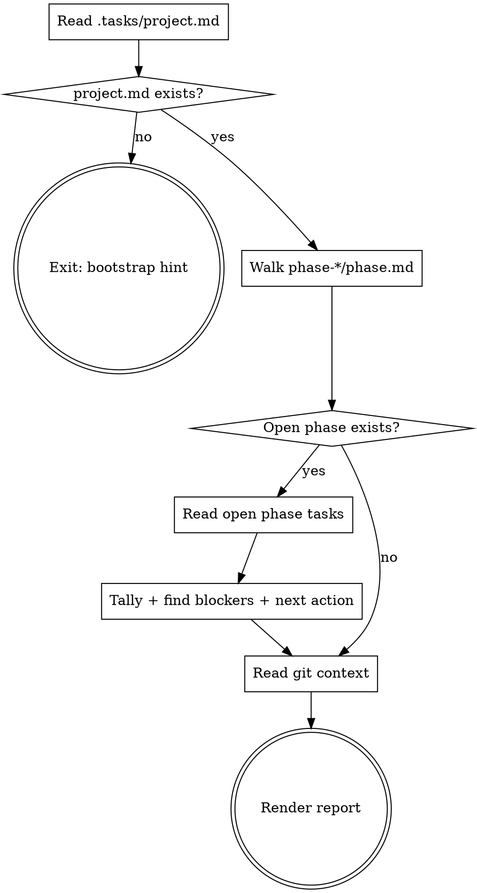

# Project Status

Reports the state of an agentflow project from `.tasks/` plus minimal git context. Strictly read-only — never opens phases, never advances tasks, never commits. If the user wants to *do* the next task, hand off to `phase-execute`.

## When to Use

- The user asks "where are we", "what's the status", "what's done", "what's left", or similar.
- A new session is starting and you need to brief yourself before working.
- Another agent or human asked for a project summary.

Do NOT use to advance work — that's `phase-execute`. Do NOT use this skill to modify any file.

## Preconditions

Requires `.tasks/project.md` in the current working directory. If absent, report:

> No agentflow project found here. Run `project-orchestrate` to bootstrap one.

…and stop. Do not search parent directories.

## Process



### Step 1 — Read project metadata

Read `.tasks/project.md`. Capture from frontmatter: `title`, `status`, `current-phase`, `github`. From the `## Phases` section, capture each phase title and whether the checkbox is `[x]` or `[ ]`.

### Step 2 — Walk phases

Glob `.tasks/phase-*/phase.md`. For each, read frontmatter: `phase`, `title`, `status` (`open` | `pending` | `closed`), `opened`, `closed`. Sort by phase number. Tally counts: closed / open / pending.

### Step 3 — Inspect the open phase

If a phase has `status: open`, glob its `task-*.md` files. For each task, read frontmatter: `id`, `title`, `status` (`pending` | `in-progress` | `done` | `blocked`), `blocked-by`.

- Tally task status counts.
- **Collect blockers**:
  - Tasks with `status: blocked` — read the `## Notes` section for the reason.
  - Tasks whose `blocked-by` references a task that is not yet `done`.
- **Determine next action**:
  - If a task has `status: in-progress` → that's the next action (resume it).
  - Else lowest-numbered `status: pending` task with no unmet `blocked-by`.
  - Else if all tasks are `done`/`blocked` → "Phase ready to close — invoke `phase-execute`."
  - Else if no open phase but pending phases remain → "Invoke `phase-execute` to open Phase N."
  - Else if all phases closed → "Project complete."

### Step 4 — Git context

Run only these read-only commands:

- `git branch --show-current`
- `git status --short`
- `git log --oneline -5`

Never run mutating git commands. If the directory is not a git repo, skip this step silently.

### Step 5 — Render report

Output a single markdown report to the user. Do not write any files. Use this template, omitting sections that don't apply:

```
# <project title>
Status: <in-progress|done> · Phase <current>/<total> · Branch: <branch>
<github URL if present>

## Phases
- [x] Phase 1: <title> (closed <date>)
- [>] Phase 2: <title> (open since <date>)
- [ ] Phase 3: <title> (pending)

## Phase <N> Progress
<D> done · <I> in-progress · <P> pending · <B> blocked  (<total> tasks)

## Blockers
- task-05-<name>: blocked-by task-04-<name> (in-progress)
- task-07-<name>: status=blocked — "<reason from Notes>"

## Next Action
Resume `task-04-<name>` (in-progress) — <title>

## Recent Activity
- <hash> <commit subject>
- <hash> <commit subject>
<"N uncommitted changes" if git status non-empty>
```

Use `[x]` for closed phases, `[>]` for the open phase, `[ ]` for pending. If there are no blockers, write "No blockers." If the project is complete, omit Blockers and Next Action.

## Edge Cases

- **No `.tasks/` folder** → bootstrap hint (see Preconditions).
- **No open phase, pending phases remain** → Next Action = "Invoke `phase-execute` to open Phase N."
- **All phases closed** → "Project complete." Skip Blockers and Next Action.
- **Open phase has no task files yet** → "Phase has no tasks yet. Invoke `phase-execute` to generate them."
- **`extension.md` exists at repo root** → append a line to the report: "Pending extension brief detected — invoke `project-orchestrate` to append." Do not read or modify the file.
- **Not a git repo** → omit the Recent Activity section silently.

## Key Rules

- **Read-only.** Never use Edit or Write. Never commit. Never run mutating git commands. Never open or close phases.
- **Source of truth is `.tasks/`.** Always read current file state — don't infer from prior conversation.
- **One report, one response.** Don't paginate. Don't ask the user follow-up questions before reporting.
- **Hand off, don't advance.** When work needs to move, point to `phase-execute` or `task-implement` — don't do it yourself.
