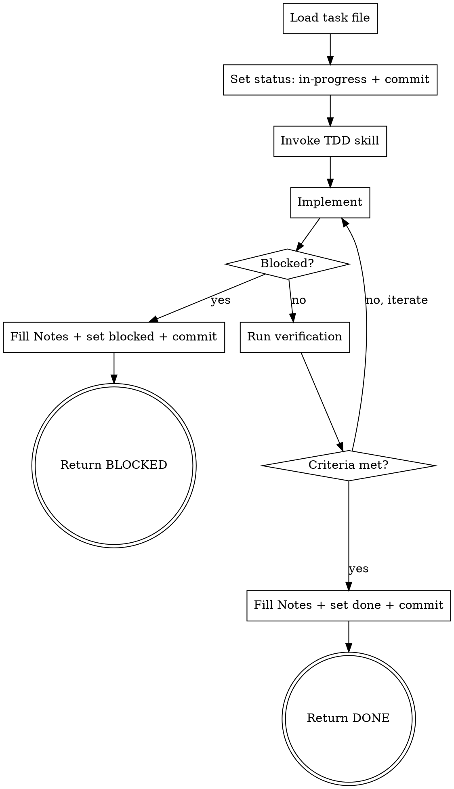

# Task Implement

Executes a single task from a `.tasks/phase-N/task-NN-name.md` file. Handles the full lifecycle: load → in-progress → implement → verify → done/blocked. Called by subagents dispatched from `phase-execute`.

## When to Use

- Dispatched as a subagent by `phase-execute` with a task file path
- Directly invoked to implement a specific task
- Auto-detect mode: one `in-progress` task exists in the current phase

## Process

### Step 1 — Load Task

Read the task file. If no path was given, scan the current phase folder for the single `in-progress` task.

Understand:
- `## Goal` — what must be accomplished
- `## Context` — background, relevant files
- `## Acceptance Criteria` — what done looks like

### Step 2 — Set In-Progress

Update task file frontmatter: `status: in-progress`

Commit: `chore(task-NN): start — <title>`

### Step 3 — Implement with TDD

Invoke `superpowers:test-driven-development` before writing any implementation code.

Use `superpowers:systematic-debugging` if you hit unexpected failures.

If you realize the task is blocked (missing dependency, ambiguous requirement, external blocker):
- Stop immediately — do not guess or work around
- Document the reason clearly in `## Notes`
- Set `status: blocked`
- Commit: `chore(task-NN): blocked — <title>`
- Return `BLOCKED`

### Step 4 — Verify

Invoke `superpowers:verification-before-completion` before marking done.

Check each acceptance criterion in the task file:
- Update `- [ ]` to `- [x]` for each criterion met
- If a criterion cannot be met, treat as blocked

### Step 5 — Fill Notes & Close

Update the `## Notes` section with:
- What was done
- Files created or modified (with paths)
- Key decisions made and why
- Any concerns or follow-up items

Update frontmatter: `status: done`

Commit: `chore(task-NN): done — <title>`

### Step 6 — Return Status

Return one of these to the calling executor:

| Status | When |
|--------|------|
| `DONE` | All acceptance criteria met, no concerns |
| `DONE_WITH_CONCERNS` | Done but with issues noted in Notes (tech debt, assumptions, risks) |
| `BLOCKED` | Could not complete — reason in Notes |

## Key Rules

- **Never skip TDD** — tests before implementation, always
- **Never guess past a blocker** — document and return BLOCKED
- **Notes are required** — the executor and future agents depend on them
- **Commit every state change** — in-progress, done, blocked
- **Read the task file fresh** — don't rely on the prompt summary; the file is the spec
